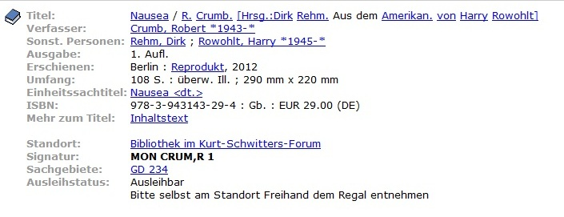
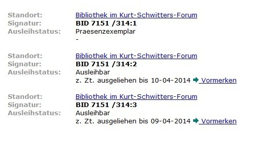
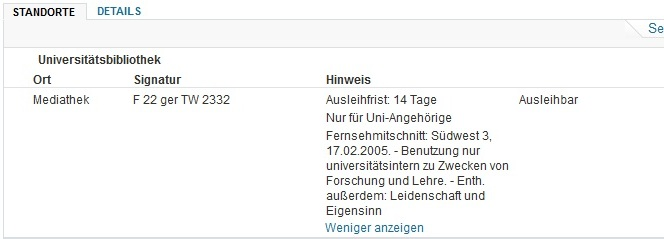

###Inhaltsverzeichnis
Einleitung
-Verfügbarkeitsanzeigen in Bibliotheksystemen
1. Lokale Bibliothekssystem (LBS)
2. Oldenburgisches Regionales Bibliotheks- und Informationssystem (ORBIS)
3. Allegro
4. Integriertes Bibliotheks-Management-System (LIBERO)
5. WIN Bibliothek-, Informations- und Ausleihsystem (WinBIAP)
6. Bibliotheksmanagementsystem aDIS/BMS (aDIS)
-Vefügbarkeitsanzeigen: Vergleich mit der Verfügbarkeitsanzeige der Document Availability Information API(DAIA)
-Unterschiede
-Ausblick

## Einleitung
Der folgende Text befasst sich mit dem Vergleich verschiedener Verfügbarkeitsanzeigen in Bibliothekssystemen.
Es gibt zahlreiche Bibliothekssysteme.Die in dieser Arbeitaufgeführten Systeme  LBS, LIBERO, aDIS, Allegro, ORBIS und WinBIAP geben nur einen kleinen Einblick. Ebenso wie die meisten anderen Bibliothekssysteme bieten sie  folgende Funktionen: Katalogisierung, Ausleih- undErwerbungssystem und den Katalog. Das ist für Nutzer und Mitarbeiter gleichermaßen komfortabel. 
Document Availability Information API (DAIA):
DAIA bedeutet “Document Availability Information API“ (Programmierschnittstelle). Es wurde vom vgl. Gemeinsamer Bibliotheksverbund (GBV), dem hessische Bibliotheksinformationssystem HeBIS und dem Beluga Projekt der Hambuger Bibliotheken entwickelt[Verfügbarkeitsrecherche mit DAIA(2014)]
Das “Ziel ist es, eine einfache und einheitliche Methode zu schaffen, um bei beliebigen Bibliothekssystemen anzufragen, ob ein bestimmter Titel zur Zeit verfügbar, d.h. einsehbar oder ausleihbar, ist.“ [Verfügbarkeitsrecherche mit DAIA(2014)]
DAIA beschränkt sich bei der Verfügbarkeitsanzeige ausschließlich auf eine angewählte Bibliothek. Im Regelfall ruft man den Katalog des betreffenden Hauses auf und recherchiert im dortigen Opac. Das heißt, der Nutzer stellt auf elektronischem Wege die Anfrage, ob der gesuchte Titel sich im Hause befindet. Durch das integrierte DAIA Datenmodell sowie die Programmierschnittstelle(API) gibt das System innerhalb eines kurzen Augenblickes die vom Nutzer gesuchte Information zurück. Lautet die Auskunft, dass der gesuchte Titel nicht im Hause, sondern entliehen ist, besteht die Möglichkeit der Vormerkung. 
Die Verfügbarkeitanzeige der DAIA unterteilt sich in „vier Dienstleistungen“ [DAIA(2009)]
Die „lokale Einsehbarkeit“: Präsenz[bestand], Datenbanken die nur im Haus genutzt werden können. [DAIA(2009)]
Die „lokaleAusleihbarkeit“: Datenbanken, die von zu Hause über den Bibliotheksaccount genutzt werden können .[DAIA(2009)]
„Externe Ausleihbarkeit / Fernleihe: Auch Datenbanken, die von Nutzern anderer Einrichtungen remote genutzt werden dürfen, zum Beispiel Nationallizenzen.
Freier Zugriff: Onlinetexte und Datenbanken ohne Lizenzeinschränkungen“[DAIA(2009)]
1.

([Daiamodel-extract.png(2009)] Bild DAIA model)
###Verfügbarkeitsanzeigen in Bibliotheksystemen

##1. Lokale Bibliothekssystem (LBS):
Das Lokale Bibliothekssystem (LBS)arbeitet bereits mit DAIA.
In der Trefferübersicht ist nicht zu erkennen, ob sich ein Titel in der Bibliothek befindet, entliehen oder vorgemerkt ist. Zu diesen konkreten Informationen kommt man erst durch Anwählen des gewünschten Titels.
Bei einem Titel, der sich in der Bibliothek befindet, sieht es dann so aus:
2. 

[LBS(© 2014)]
Bei Titeln, die entliehen sind, findet der Nutzer das eigentliche Abgabedatum des Titels vor. Der Nutzer hat über die Vormerkfunktion die Möglichkeit , diesen Titel schnellstmöglich zu erhalten. 
3.

[LBS(© 2014)]
Weitere Möglichkeiten wie die Verfügbarkeit im Katalog aussehen kann, sind.

## a) die Bestellung
4.

[LBS(© 2014)]

## b) der Präsenzbestand
5.

[LBS(© 2014)]
Die hier aufgeführten Verfügbarkeitsmöglichkeiten finden sich fast überall wieder, je nach Bibliothekssystem unterscheiden sich Darstellung und Formulierung.  

##2. ORBIS
Im Bibliothekssystem ORBIS gleichtdie Übersicht der im LBS: auch hier muss erst der gewünschte Titel ausgewählt werden, um die gesuchte Information zu bekommen.
Ein auffälliger Unterschied zum LBS ist jedoch die Spalte „Hinweis“. In dieser findet der Nutzer die Information, für welchen Zeitraum er den Titel ausleihen kann. Im Bibliotheksystemm ORBIS gibt es folgende Ansichten:

## a)die Kurzausleihe 
6.

[Orbis(oJ)]

## 3. Allegro 3.1:
Auch hier gibt die Trefferübersicht selbst nicht die vom Nutzer gesuchte Antwort, es verhält sich hier wie im LBS. In den oben genannten Beispielen unterscheidet sich Allegro durch andere Bezeichnungen der Verfügbarkeit.
## 4.Integriertes Bibliotheks-Management-System LIBERO: 
Bei LIBERO verhält es sich wie bei Allegro.
 
## 5.WIN Bibliothek-, Informations- und Ausleihsystem  (WinBIAP):
In dem Bibliothekssystem WinBIAP findet man bereits in der Trefferübersicht eine erste Antwort auf die Frage der Verfügbarkeit.
7.

[WINBiap(2011)]

## 6.Bibliotheksmanagementsystem aDIS/BMS (aDIS): 
aDIS hat in der Trefferübersicht Symbole, die gedeutet werden können. Eine Schwierigkeit ist allerdings, dass ein Symbol mehrfach mit verschiedenen Verfügbarkeitsmöglichekeiten belegt ist.

## Vefügbarkeitsanzeigen: Vergleich mit der Verfügbarkeitsanzeige der Document Availability Information API(DAIA): 
8.

[Vergleichstabelle(2014)]

### Unterschiede
Das Document Availability Information AP DAIA beschränkt sich aus Nutzersicht auf die nötigsten, konkreten und wichtigsten Angaben wie zum Beipsiel. Ausgliehen bis zum 23.04.14 Vormerken
Auffällig beim LBS ist, dass keine konkrete Ausleihzeit in Tagen benannt wird.(Siehe Abbildung Beispiel ORBIS Kurzausleihe) So könnte der Nutzer von vorneherein sehen, ob es sich um eine verkürzte oder um eine reguläre Ausleihe handelt. Eine allgemeine Ausnahme bildet der Präsenzbestand, denn dieser ist jeweils immer nur im Haus einsehbar. 
Der auffälligste Unterschied besteht in den Formulierungen der Verfügbarkeitsanzeige in den vereinzelten Systemen.
Im Vergleich zu DAIA drücken sich andere Systeme offener aus: Der Titel ist „verfügbar“. Das kann dieselbe Bedeutung wie „ausleihbar“ haben. Möglich ist auch die Interpretation von “verfügbar“ im Sinne von Präsenzexemplar. Das Haus hat den Titel im Bestand und er ist zugänglich, jedoch nicht entleihbar. Informationen wie „der Titel ist vermisst“ sind sehr informativ, aber auch wieder weit auslegbar. So könnte der Titel im Haus selbst vermisst sein oder durch einen Nutzer, der seine Rückgabefrist vergaß, noch nicht wieder zurückgegeben worden sein. 
Der Unterschied zu „nicht verfügbar“ ist wie bei den oben genannten Möglichkeiten nicht konkret geklärt. Eine Möglichkeit wäre, dass der Titel sich im Geschäftsgang befindet oder vermisst ist, der Titel könnte auch in der Fernleihe sein. Diese variablen Möglichkeiten finden sich in mehreren Systemen wieder - der Nutzer bekommt zwar die Information, die er braucht, aber keine eindeutige, konkrete Antwort.
Alles in allem kann man sagen, dass die Entwicklung des DAIA für ein einheitliches sowie konkretes Bild der Verfügbarkeit steht. Es stellt sich die Frage, ob man die Trefferübersicht nicht wie bei WinBIAP gestalten sollte, also eine weitere Spalt anfügt, die die erste Frage nach der generellen Verfügbarkeit beantwortet: Ist der Titel für den Nutzer zugänglich oder nicht?

### Ausblick
Als ein mögliches neues Ziel könnte die Entleihbarkeit bei Vormerkungen/Bestellungen einheitlich gestaltet werden. Derzeitig gibt es die verschiedensten Varianten. Nach einer Suche im Katalog nach einem vorgemerkten Buch bekommt man sofort den entsprechenden Button angezeigt. Nach Betätigen des Buttons soll man sich anmelden, um die Reservierung/Vormerkung dem Nutzer zuzuordnen.
Bei anderen Systemen wird die Möglichkeit der Vormerkung/Bestellung erst nach der Anmeldung angeboten.
Ein weiteres Ziel wäre, wie oben beschrieben, in der Trefferübersicht eine weitere Spalte anzufügen, um dem Nutzer gleich aufzuzeigen, ob der Titel im Haus ist oder ob er ihn bestellen/vormerken kann.
Ein großes Ziel wäre eine einheitliche Formulierung in den Verfügbarkeitsanzeigen zu schaffen. Derzeitig ist die Formulierung noch sehr offen und mehrdeutig.

